# TourPad User Journeys - Complete Flow Documentation

## Overview
This document provides detailed step-by-step user journeys for all user types in TourPad, including decision points, error states, and alternative paths.

## Quick Navigation
- [Artist Journey](#artist-journey)
- [Host Journey](#host-journey)
- [Fan Journey](#fan-journey)
- [Admin Journey](#admin-journey)
- [Cross-User Interactions](#cross-user-interactions)
- [Error States & Edge Cases](#error-states--edge-cases)

---

## Artist Journey

### Phase 1: Discovery & Registration
```mermaid
graph TD
    A[Artist discovers TourPad] --> B[Visits Landing Page /]
    B --> C[Clicks "For Artists"]
    C --> D[Reads /for-artists page]
    D --> E[Clicks "Get Started"]
    E --> F[Registration Page /register]
    F --> G[Selects "Artist" user type]
    G --> H[Google OAuth Login]
    H --> I[Artist Onboarding Form /onboarding/artist]
```

#### 1.1 Landing Page Interaction (`/`)
**User Actions:**
- Views artist value proposition
- Reads success stories
- Clicks "For Artists" or "Get Started"

**System Response:**
- Displays coastal-themed landing page
- Shows artist benefits (booking opportunities, lodging, community)
- Provides clear call-to-action

#### 1.2 Artist Information Page (`/for-artists`)
**User Actions:**
- Learns about platform benefits
- Reviews artist requirements
- Understands pricing ($400/year)
- Clicks registration button

**System Response:**
- Shows detailed artist onboarding information
- Displays sample artist profiles
- Explains booking and tour planning features

#### 1.3 Registration Process (`/register`)
**User Actions:**
- Selects "Artist" from user type options
- Proceeds to Google OAuth

**System Response:**
- Creates user account with `userType: 'ARTIST'`
- Sets initial status to `PENDING`
- Redirects to artist onboarding

#### 1.4 Artist Onboarding (`/onboarding/artist`)
**User Actions:**
- Fills comprehensive artist application:
  - Personal information (name, email, location)
  - Artist details (stage name, genres, bio)
  - Technical requirements (equipment, setup needs)
  - Experience level and tour history
  - Performance video upload
  - Press photos upload
  - Social media links
  - Musical samples or streaming links

**System Response:**
- Validates all required fields
- Uploads media files to storage
- Creates Artist record in database
- Sets status to `PENDING`
- Redirects to holding page

### Phase 2: Application Review & Approval
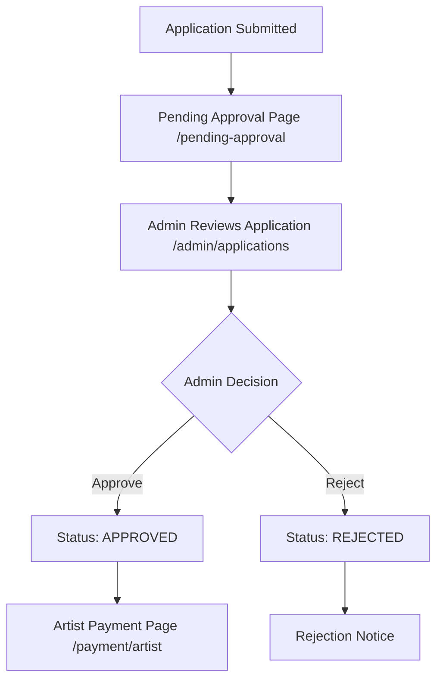

#### 2.1 Pending Approval State (`/pending-approval`)
**User Experience:**
- Sees "Application Under Review" message
- Cannot access dashboard features
- Receives status updates via email
- Can update contact information

**System Behavior:**
- Middleware redirects dashboard access to holding page
- User can only access public routes
- Application appears in admin queue

#### 2.2 Admin Review Process (`/admin/applications`)
**Admin Actions:**
- Reviews artist application details
- Views uploaded photos and videos
- Checks social media presence
- Makes approval/rejection decision
- Adds admin notes

**System Response:**
- Updates user status in database
- Triggers notification email
- Logs admin action for audit trail

#### 2.3 Approval Notification
**If Approved:**
- Email notification with payment instructions
- Status changes to `APPROVED`
- Redirect to payment page on next login

**If Rejected:**
- Email with rejection reason
- Status changes to `REJECTED`
- Access remains limited to public routes

### Phase 3: Payment & Activation
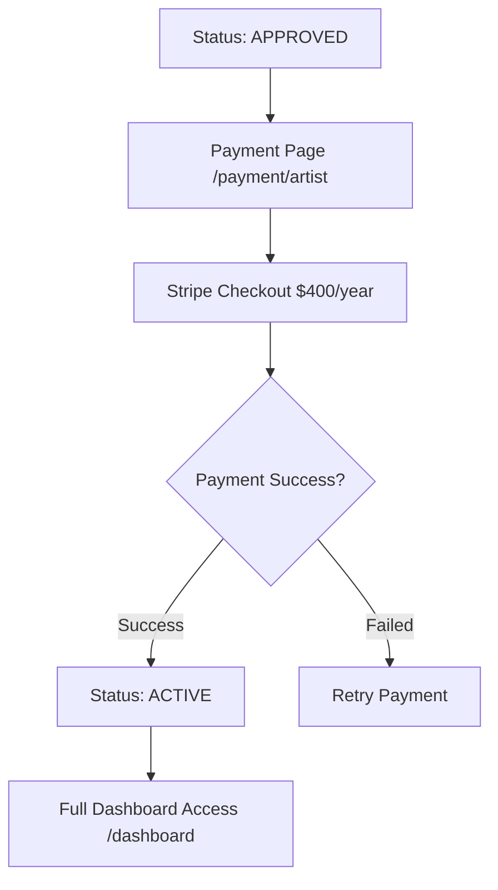

#### 3.1 Artist Payment (`/payment/artist`)
**User Actions:**
- Reviews $400/year membership details
- Clicks "Start Your Music Journey"
- Completes Stripe checkout

**System Response:**
- Creates Stripe checkout session
- Processes payment via webhooks
- Updates user status to `ACTIVE`
- Creates subscription record

#### 3.2 Payment Success (`/payment/success`)
**User Experience:**
- Confirmation of successful payment
- Welcome message and next steps
- Direct link to dashboard

**System Response:**
- Stripe webhook updates database
- User status: `APPROVED` → `ACTIVE`
- Full platform access granted

### Phase 4: Profile Setup & Onboarding
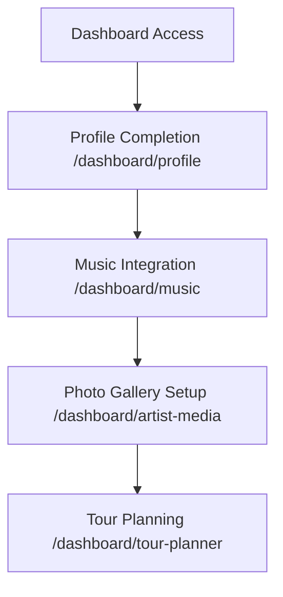

#### 4.1 Profile Completion (`/dashboard/profile`)
**User Actions:**
- Completes detailed artist profile
- Uploads high-quality press photos
- Sets performance preferences
- Configures equipment needs
- Updates bio and experience

**System Response:**
- Saves profile data to Artist model
- Updates search visibility
- Enables discovery by hosts

#### 4.2 Music Integration (`/dashboard/music`)
**User Actions:**
- Connects Spotify account
- Connects SoundCloud account
- Uploads direct MP3 files
- Organizes music samples

**System Response:**
- Syncs streaming platform data
- Creates SpotifyAlbum/Track records
- Creates SoundCloudTrack records
- Enables music playback on profile

#### 4.3 Media Gallery (`/dashboard/artist-media`)
**User Actions:**
- Uploads performance photos
- Uploads band photos
- Adds press materials
- Organizes media categories

**System Response:**
- Creates ArtistMedia records
- Optimizes images for web
- Updates profile gallery display

### Phase 5: Active Platform Use
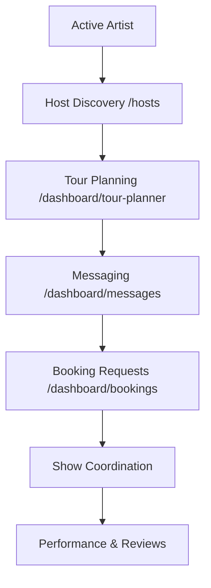

#### 5.1 Host Discovery (`/hosts`)
**User Actions:**
- Browses host directory
- Filters by location, capacity, genres
- Views host profiles and venues
- Reads musical preferences
- Checks availability calendars

**System Response:**
- Displays approved hosts only
- Shows host photos and details
- Provides messaging capability
- Shows location on map

#### 5.2 Tour Planning (`/dashboard/tour-planner`)
**User Actions:**
- Creates tour segments
- Sets geographic regions and dates
- Plans state-by-state schedules
- Marks tours as public/private

**System Response:**
- Creates TourSegment and TourStateRange records
- Validates date overlaps
- Enables host discovery by tour location
- Updates artist profile with upcoming tours

#### 5.3 Messaging (`/dashboard/messages`)
**User Actions:**
- Contacts hosts about availability
- Discusses performance details
- Shares music samples
- Negotiates terms

**System Response:**
- Creates Conversation records
- Enables real-time messaging
- Supports file attachments
- Tracks message read status

#### 5.4 Booking Management (`/dashboard/bookings`)
**User Actions:**
- Submits booking requests
- Responds to host approvals
- Confirms show details
- Manages 5-day confirmation window

**System Response:**
- Creates Booking records
- Tracks booking status workflow
- Sends notifications to all parties
- Updates calendar availability

#### 5.5 Show Coordination (`/bookings/coordination`)
**User Actions:**
- Plans show logistics
- Confirms equipment setup
- Arranges lodging details
- Coordinates with fans

**System Response:**
- Updates booking details
- Manages RSVP system
- Facilitates group communication
- Tracks pre-show checklist

#### 5.6 Performance & Reviews
**User Actions:**
- Performs at house concerts
- Interacts with fan community
- Receives and responds to reviews
- Builds platform reputation

**System Response:**
- Updates concert status to COMPLETED
- Enables review system
- Tracks performance history
- Calculates artist ratings

---

## Host Journey

### Phase 1: Discovery & Registration
```mermaid
graph TD
    A[Host discovers TourPad] --> B[Visits Landing Page /]
    B --> C[Clicks "For Hosts"]
    C --> D[Reads /for-hosts page]
    D --> E[Clicks "Become a Host"]
    E --> F[Registration Page /register]
    F --> G[Selects "Host" user type]
    G --> H[Google OAuth Login]
    H --> I[Host Onboarding Form /onboarding/host]
```

#### 1.1 Host Information Page (`/for-hosts`)
**User Actions:**
- Learns about hosting opportunities
- Reviews hosting requirements
- Understands no payment required
- Reads venue safety guidelines

**System Response:**
- Shows successful host stories
- Explains approval process
- Displays sample venue profiles
- Provides hosting resources

#### 1.2 Host Onboarding (`/onboarding/host`)
**User Actions:**
- Fills comprehensive venue application:
  - Venue information (name, type, capacity)
  - Location details (address, coordinates)
  - Venue photos (multiple categories)
  - Hosting experience and preferences
  - Musical genre preferences
  - Sound system details
  - House rules and requirements
  - Lodging offering (optional)
  - Availability calendar

**System Response:**
- Validates venue requirements
- Uploads and processes photos
- Creates Host record
- Sets up HostMedia records
- Generates obfuscated coordinates for privacy

### Phase 2: Application Review & Approval
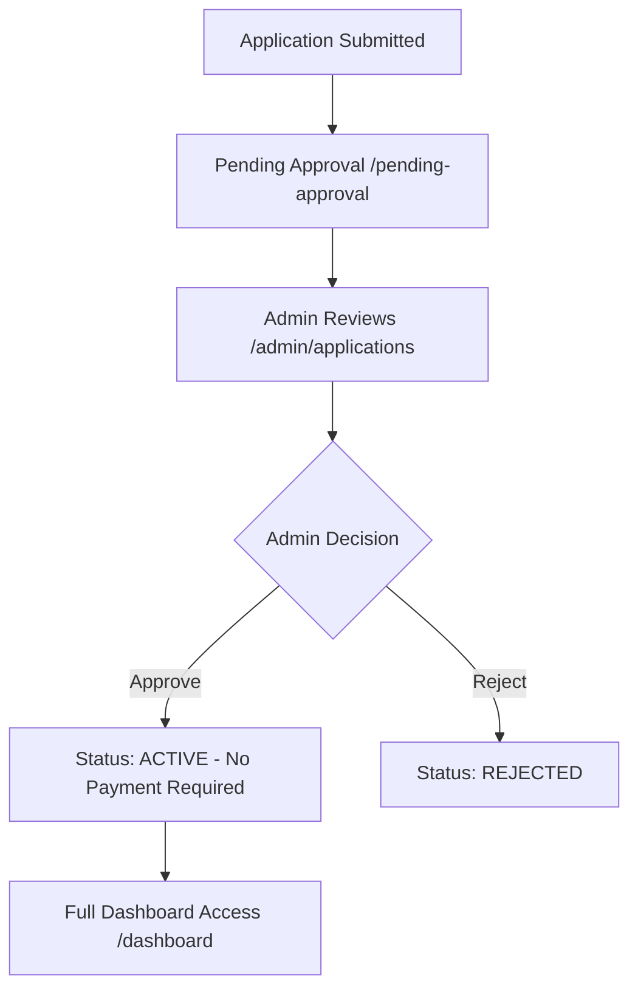

#### 2.1 Admin Review for Hosts
**Admin Evaluation Criteria:**
- Venue safety and suitability
- Photo quality and accuracy
- Hosting experience level
- Location appropriateness
- Community guideline compliance

**System Response:**
- Updates status directly to `ACTIVE` (no payment required)
- Enables full dashboard access
- Makes venue discoverable to artists

### Phase 3: Venue Setup & Configuration
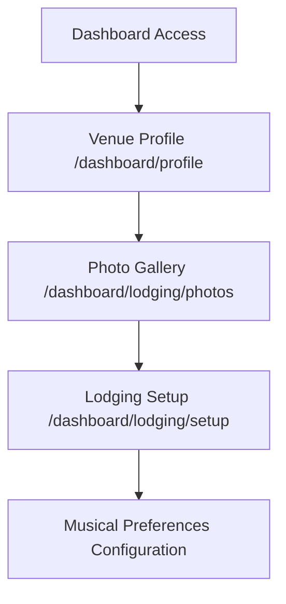

#### 3.1 Venue Profile Completion (`/dashboard/profile`)
**User Actions:**
- Completes detailed venue information
- Sets capacity and layout details
- Configures sound system specs
- Updates availability calendar
- Sets hosting preferences

**System Response:**
- Updates Host model data
- Validates venue information
- Enables artist discovery
- Updates search filters

#### 3.2 Photo Gallery Management (`/dashboard/lodging/photos`)
**User Actions:**
- Uploads venue photos by category:
  - Venue overview
  - Performance space
  - Past show photos
  - Lodging areas (if offered)
- Organizes photo display order
- Adds photo descriptions

**System Response:**
- Creates HostMedia records
- Optimizes images for gallery display
- Updates venue profile presentation
- Enables lightbox viewing

#### 3.3 Lodging Configuration (`/dashboard/lodging/setup`)
**User Actions (if offering lodging):**
- Configures room details
- Sets bed configurations
- Lists amenities
- Sets house rules
- Determines pricing/donation

**System Response:**
- Updates lodgingDetails JSON
- Enables lodging discovery
- Integrates with booking system
- Updates search filters

#### 3.4 Musical Preferences Setup
**User Actions:**
- Selects preferred genres
- Sets act size preferences (solo, duo, full band)
- Defines content rating preferences
- Specifies music they enjoy hosting
- Lists genres to avoid

**System Response:**
- Updates preferredGenres array
- Stores preferences in lodgingDetails
- Enables smart artist matching
- Improves discovery algorithms

### Phase 4: Active Hosting
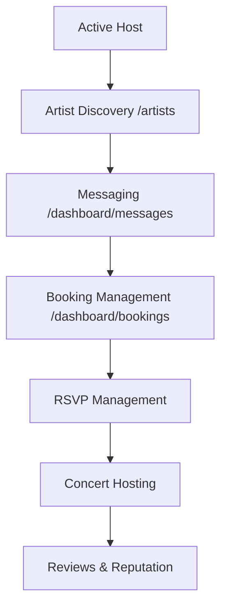

#### 4.1 Artist Discovery (`/artists`)
**User Actions:**
- Browses artist directory
- Filters by tour schedules and location
- Views artist profiles and music
- Checks artist tour dates in their area
- Reviews artist experience and style

**System Response:**
- Shows artists with tours in host area
- Displays upcoming tour segments
- Enables music preview playback
- Provides direct messaging links

#### 4.2 Hosting Communication
**User Actions:**
- Responds to artist inquiries
- Discusses show logistics
- Shares venue details and requirements
- Negotiates door fees and logistics

**System Response:**
- Manages conversation threads
- Tracks response times
- Supports file sharing
- Maintains message history

#### 4.3 Booking Approval Process
**User Actions:**
- Reviews booking requests
- Checks calendar availability
- Approves or declines requests
- Sets specific show requirements

**System Response:**
- Updates booking status
- Notifies artist of decision
- Blocks calendar dates for approved shows
- Starts 5-day artist confirmation timer

#### 4.4 RSVP Management
**User Actions:**
- Reviews fan RSVP requests
- Approves attendance based on capacity
- Manages waitlist for popular shows
- Communicates with attendees

**System Response:**
- Updates FanRSVP records
- Tracks capacity limits
- Sends approval/denial notifications
- Manages concert logistics

#### 4.5 Concert Management
**User Actions:**
- Prepares venue for performance
- Welcomes artists and fans
- Manages door fee collection
- Ensures community guidelines compliance
- Facilitates artist-fan interactions

**System Response:**
- Updates concert status
- Tracks attendance
- Enables post-show reviews
- Records successful hosting events

---

## Fan Journey

### Phase 1: Discovery & Registration
```mermaid
graph TD
    A[Fan discovers TourPad] --> B[Visits Landing Page /]
    B --> C[Explores concert listings]
    C --> D[Sees "Fan Membership Required"]
    D --> E[Registration /register]
    E --> F[Selects "Fan" type]
    F --> G[Immediate Payment /payment/fan]
```

#### 1.1 Fan Discovery
**User Actions:**
- Browses public concert listings
- Sees limited preview of community
- Learns about house concert culture
- Decides to join community

**System Response:**
- Shows teaser content
- Explains fan membership benefits
- Highlights unique concert experiences
- Directs to immediate payment

### Phase 2: Payment & Immediate Access
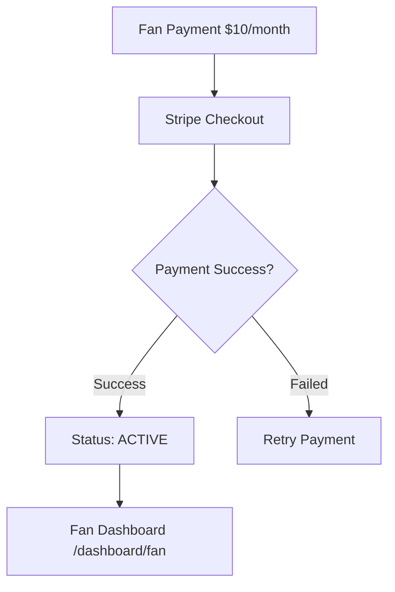

#### 2.1 Fan Payment (`/payment/fan`)
**User Actions:**
- Reviews $10/month subscription details
- Understands recurring billing
- Completes Stripe checkout

**System Response:**
- Creates monthly subscription
- Processes payment immediately
- Sets status to `ACTIVE`
- Grants full platform access

### Phase 3: Profile Setup
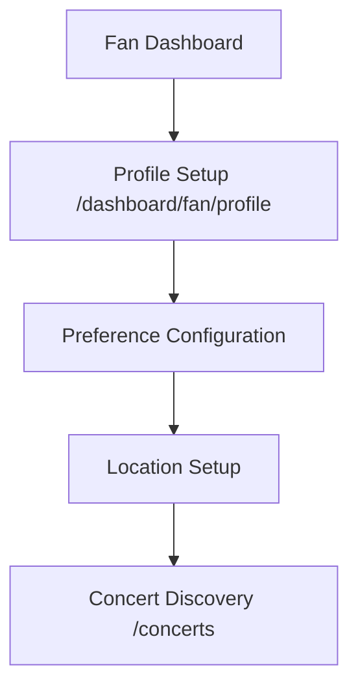

#### 3.1 Fan Profile (`/dashboard/fan/profile`)
**User Actions:**
- Sets location and travel radius
- Selects favorite music genres
- Uploads profile photo
- Writes personal bio
- Sets notification preferences

**System Response:**
- Creates Fan model record
- Enables personalized recommendations
- Updates discovery algorithms
- Improves matching with local events

### Phase 4: Concert Discovery & Participation
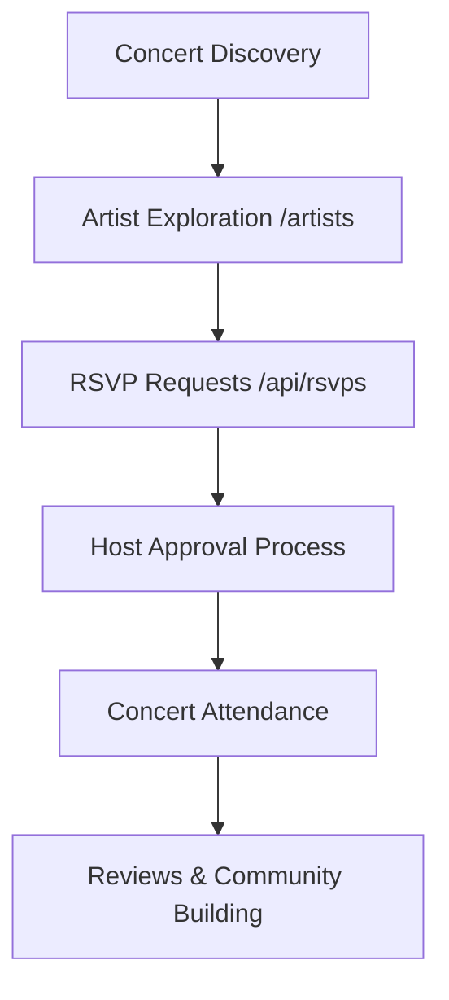

#### 4.1 Concert Discovery (`/concerts`)
**User Actions:**
- Browses available house concerts
- Filters by genre, date, location
- Views artist profiles and music samples
- Checks venue details and capacity

**System Response:**
- Shows concerts in fan's travel radius
- Displays real-time availability
- Provides music preview playback
- Shows venue photos and details

#### 4.2 RSVP System
**User Actions:**
- Submits RSVP requests
- Specifies guest count
- Adds special requests or questions
- Waits for host approval

**System Response:**
- Creates FanRSVP records
- Checks capacity limits
- Notifies host of request
- Tracks approval status

#### 4.3 Concert Attendance
**User Actions:**
- Receives confirmation details
- Travels to venue
- Enjoys house concert experience
- Networks with artists and other fans
- Follows community guidelines

**System Response:**
- Provides venue contact information
- Tracks attendance
- Updates concert participation history
- Enables post-show features

#### 4.4 Review & Community Building
**User Actions:**
- Writes reviews for attended concerts
- Rates artist performance and venue
- Builds connections with artists
- Develops community reputation

**System Response:**
- Creates Review records
- Updates artist/venue ratings
- Tracks fan engagement
- Provides community recognition

---

## Admin Journey

### Phase 1: Admin Access & Overview
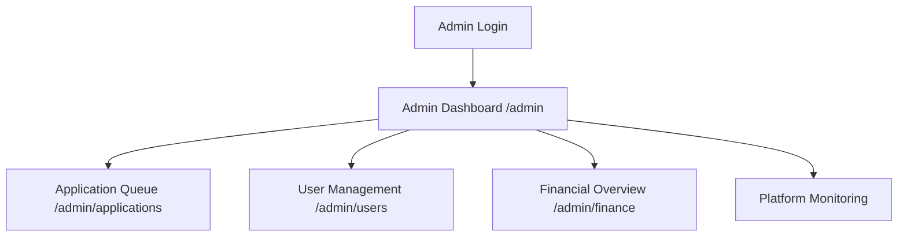

#### 1.1 Admin Dashboard (`/admin`)
**Admin Actions:**
- Reviews platform metrics
- Monitors pending applications
- Checks system health
- Reviews recent activity

**System Response:**
- Displays real-time statistics
- Shows priority action items
- Provides navigation to all admin tools
- Highlights issues requiring attention

### Phase 2: Application Review Process
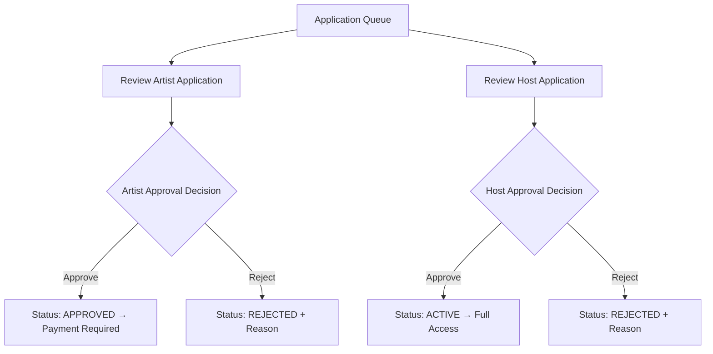

#### 2.1 Artist Application Review
**Admin Evaluation:**
- Reviews artistic quality and presentation
- Checks social media presence
- Evaluates performance experience
- Assesses community fit
- Reviews uploaded media quality

**Admin Actions:**
- Views application details
- Examines photos/videos in lightbox
- Checks external links
- Makes approval/rejection decision
- Adds review notes

#### 2.2 Host Application Review
**Admin Evaluation:**
- Assesses venue suitability and safety
- Reviews photo quality and accuracy
- Evaluates hosting experience
- Checks location appropriateness
- Ensures community guideline compliance

**Admin Actions:**
- Reviews venue details
- Examines venue photos
- Verifies location information
- Makes approval/rejection decision
- Documents decision rationale

### Phase 3: Platform Management
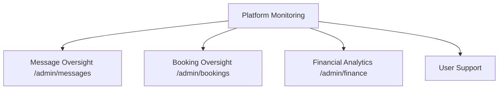

#### 3.1 Message Monitoring (`/admin/messages`)
**Admin Actions:**
- Reviews flagged conversations
- Monitors for inappropriate content
- Responds to user reports
- Enforces community guidelines

**System Response:**
- Provides read-only access to all conversations
- Highlights reported content
- Tracks admin oversight activity
- Maintains user privacy while ensuring safety

#### 3.2 Booking Oversight (`/admin/bookings`)
**Admin Actions:**
- Monitors booking disputes
- Reviews cancellation requests
- Ensures policy compliance
- Provides customer support

**System Response:**
- Shows all platform bookings
- Highlights issues requiring attention
- Provides intervention tools
- Tracks resolution outcomes

#### 3.3 Financial Management (`/admin/finance`)
**Admin Actions:**
- Reviews revenue analytics
- Monitors subscription health
- Tracks payment failures
- Generates financial reports

**System Response:**
- Displays revenue dashboards
- Shows subscription metrics
- Provides payment status overview
- Enables financial export

---

## Cross-User Interactions

### Artist ↔ Host Interactions
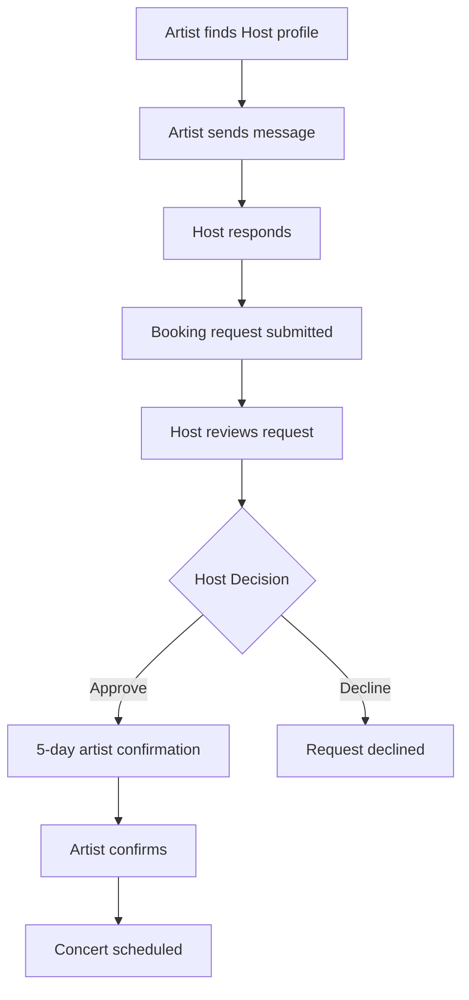

### Host ↔ Fan Interactions
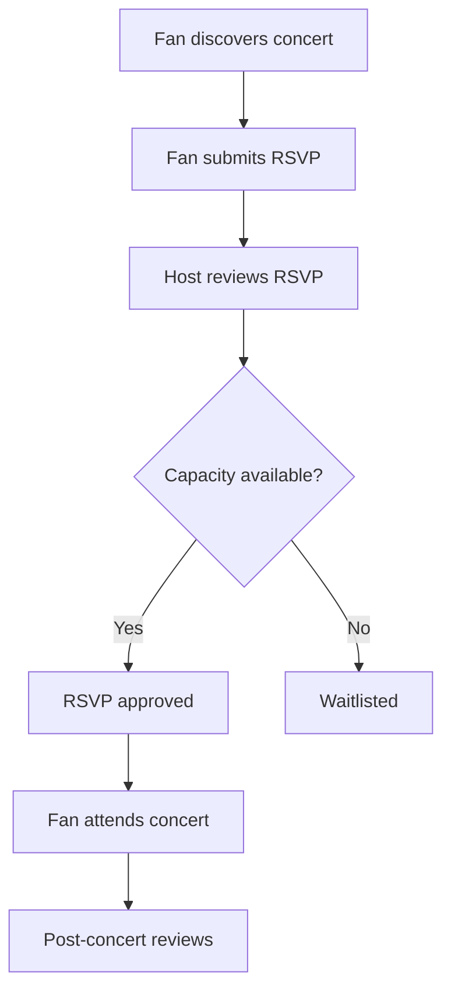

### Artist ↔ Fan Interactions
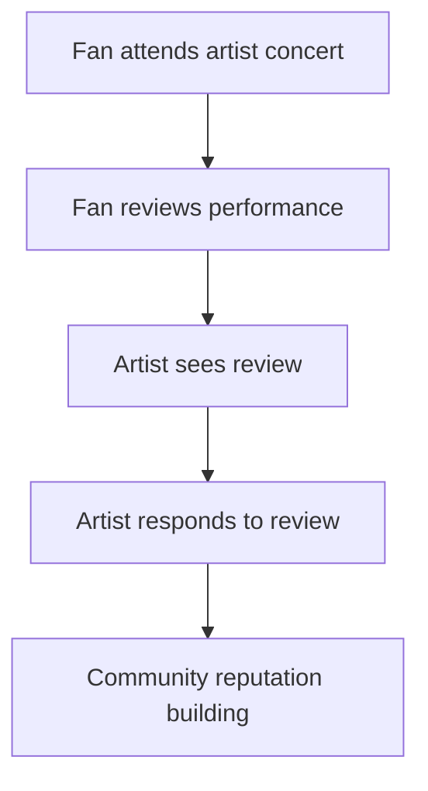

---

## Error States & Edge Cases

### Payment Failures
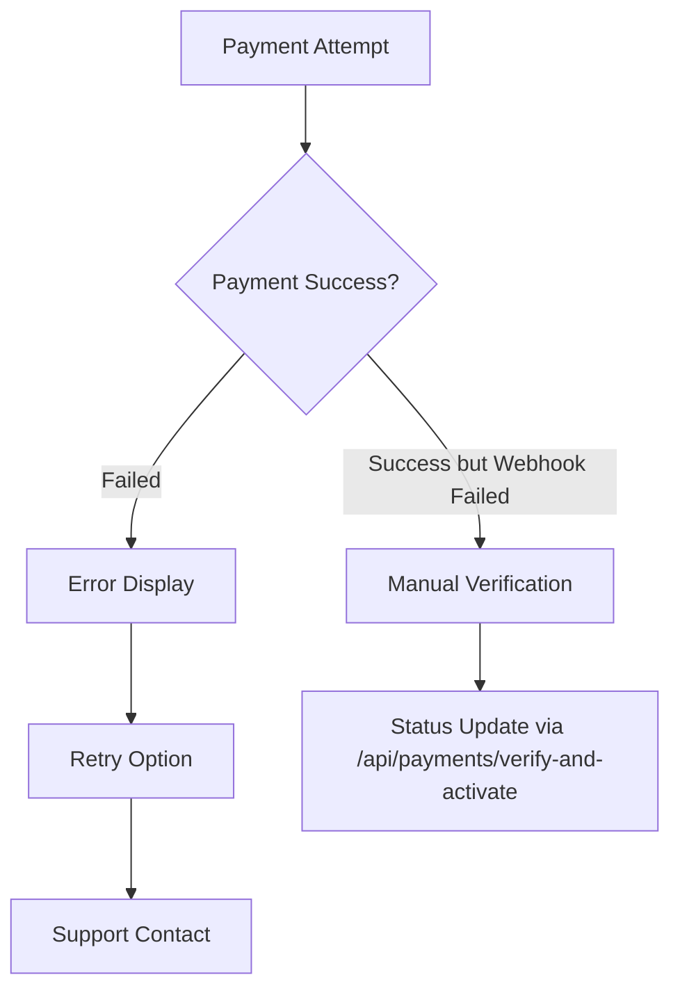

### Application Rejections
**Artist Rejection Flow:**
1. Admin rejects application with reason
2. Status set to `REJECTED`
3. User redirected to rejection notice
4. Option to reapply with improvements

**Host Rejection Flow:**
1. Admin rejects venue application
2. Status set to `REJECTED`
3. User sees rejection reason
4. Guidance for reapplication provided

### Booking Conflicts
**Double Booking Prevention:**
1. Calendar availability checked in real-time
2. Booking requests lock calendar dates
3. Conflicts detected and prevented
4. Users notified of conflicts

**Cancellation Handling:**
1. Either party can request cancellation
2. Admin mediation for disputes
3. Refund processing if applicable
4. Calendar dates released

### Message System Issues
**Failed Message Delivery:**
1. Retry mechanism with exponential backoff
2. Offline message queuing
3. User notification of delivery status
4. Admin tools for message recovery

### Subscription Lapses
**Fan Subscription Expiry:**
1. Warning notifications before expiry
2. Grace period for renewal
3. Feature access restriction
4. Easy renewal process

---

This comprehensive user journey documentation covers every major path through the TourPad platform, including success cases, error handling, and cross-user interactions. Each journey is designed to be intuitive while maintaining platform safety and community standards.